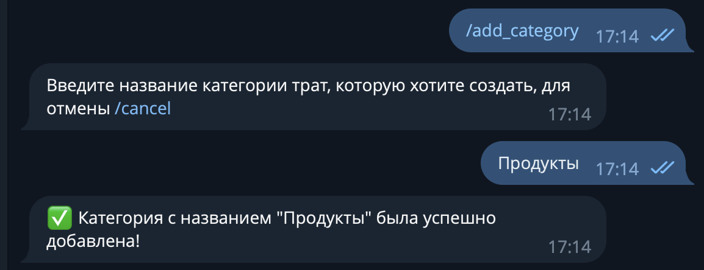
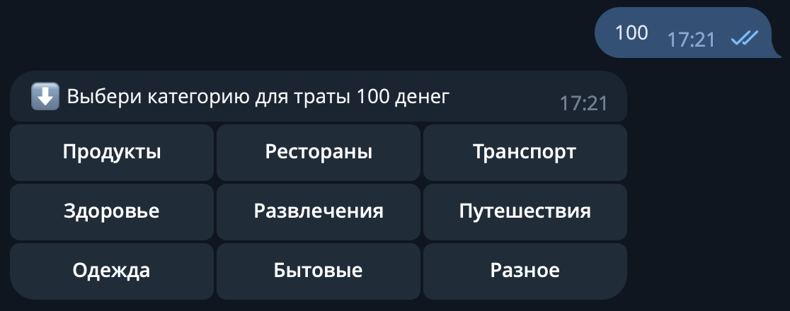
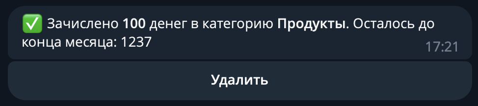
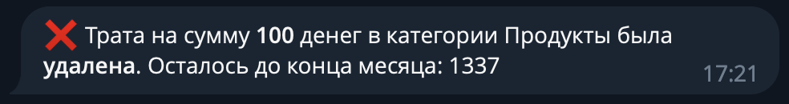

# cheapskate - telegram bot and API for financial control

## Information

### Description

Telegram bot and REST API for convenient control of your expenses and obtaining convenient statistics on spending.

### Features

- REST API with swagger documentation, allows to connect backend to your custom interface like mobile apps, sites, etc;
- Telegram bot that provides a convenient interface for managing expenses;
- Ability to add categories of expenses, which will be displayed as a keyboard in the bot when adding expenses;
- Ability to add and remove expenses by category from the list of previously added ones;
- Various options to get statistics on spending (today's spending, remaining money for the month, statistics by month and years, etc.);
- Authentication system;
- Error handling and logging;
- Asynchronous interaction between telegram bot and API.

### Author

Ilya Malashenko (github: melax08, telegram: @ScreamOFF)

### System requirements
- Python 3.11;
- Docker (19.03.0+) with docker compose for easy run.

### Tech stack
[![Python][Python-badge]][Python-url]
[![FastAPI][FastAPI-badge]][FastAPI-url]
[![Python-telegram-bot][Python-telegram-bot-badge]][Python-telegram-bot-url]
[![Postgres][Postgres-badge]][Postgres-url]
[![SQLAlchemy][SQLAlchemy-badge]][SQLAlchemy-url]
[![Poetry][Poetry-badge]][Poetry-url]
[![Docker][Docker-badge]][Docker-url]

## Installation and start

<details>
<summary>
Via docker
</summary>
<br>
Clone the repo and change directory to it:

```shell
git clone https://github.com/melax08/cheapskate.git && cd cheapskate
```

Create an `.env` file in the `src` directory and add the necessary environment variables to it (check `src/.env.example` for necessary variables.)
```shell
mv src/.env.example src/.env
```
```shell
vi src/.env
```

Run `docker compose` to create docker containers:
```shell
docker compose up -d
```
or
```shell
docker-compose up -d
```

</details>

## Settings and documentation

### Settings

In progress

### Telegram commands and usage

Only Telegram users whose IDs are listed in the `ALLOWED_TELEGRAM_IDS` (check the `.env.example` file for details) environment variable have access to the bot. If there is no ID in this environment variable, then all users have access to the bot (not recommended).

First, you need to create spending categories so that you can add expenses to them in the future.

To do this, send the `/add_category` command to the bot and follow the instructions.



Once at least one category has been created, you can add expenses. To do this, send the bot the amount of money that was spent, and then select the category to which the spending belongs.





If an expense was added by mistake, or the wrong category was selected, you can click on the delete expense button.



### API documentation

In progress

<!-- MARKDOWN LINKS & BADGES -->
[Python-url]: https://www.python.org/
[Python-badge]: https://img.shields.io/badge/Python-376f9f?style=for-the-badge&logo=python&logoColor=white
[Python-telegram-bot-url]: https://github.com/python-telegram-bot/python-telegram-bot
[Poetry-url]: https://python-poetry.org
[Poetry-badge]: https://img.shields.io/badge/poetry-blue?style=for-the-badge&logo=Poetry&logoColor=white&link=https%3A%2F%2Fpython-poetry.org
[Python-telegram-bot-badge]: https://img.shields.io/badge/python--telegram--bot-4b8bbe?style=for-the-badge
[Postgres-url]: https://www.postgresql.org/
[Postgres-badge]: https://img.shields.io/badge/postgres-306189?style=for-the-badge&logo=postgresql&logoColor=white
[SQLAlchemy-url]: https://www.sqlalchemy.org
[SQLAlchemy-badge]: https://img.shields.io/badge/sql-alchemy-red?style=for-the-badge
[FastAPI-url]: https://fastapi.tiangolo.com
[FastAPI-badge]: https://img.shields.io/badge/FastAPI-005571?style=for-the-badge&logo=fastapi
[Docker-url]: https://www.docker.com
[Docker-badge]: https://img.shields.io/badge/docker-%230db7ed.svg?style=for-the-badge&logo=docker&logoColor=white